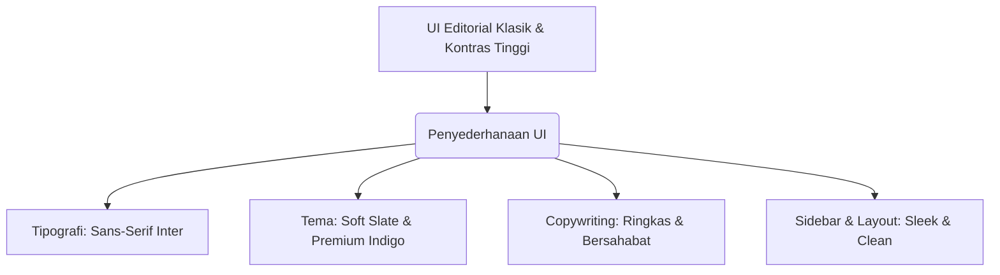

# Rencana Implementasi: Sederhanakan UI & Tema Admin Panel (Minimalis Modern)

Rencana ini bertujuan untuk menyederhanakan antarmuka pengguna (UI) Admin Panel Flustra. Desain editorial serif yang saat ini digunakan (dengan font *Gelasio* yang padat dan warna ber-kontras tinggi) akan diubah menjadi desain **Minimalis Modern (SaaS-like)**. Fokus utama adalah pada peningkatan keterbacaan, kebersihan visual, penyederhanaan tata bahasa (copywriting), serta penggunaan palet warna yang tenang dan profesional.

---

## Ringkasan Perubahan

---

## Detail Perubahan yang Diusulkan

### 1. Tipografi Modern & Bersih (Typography)
*   **Sebelumnya**: Menggunakan serif font `Gelasio` yang bergaya surat kabar klasik dan padat.
*   **Sesudahnya**: Menggunakan sans-serif font `Inter` dari Google Fonts untuk seluruh panel administrasi demi estetika teknologi modern yang bersih, tajam, dan sangat mudah dibaca.
*   **Aksi**:
    *   Mengintegrasikan font Google `Inter` pada file tata letak utama [admin.blade.php](file:///d:/flustra%20-%20codingan/flustra-artikel/resources/views/layouts/admin.blade.php).
    *   Memperbarui variabel CSS `--font-serif` (atau mengalihkannya ke font sans-serif default) di [app.css](file:///d:/flustra%20-%20codingan/flustra-artikel/resources/css/app.css).

### 2. Palet Warna & Tema Minimalis (Theme & Styling)
*   **Sebelumnya**: Dominasi warna hitam pekat (`#111111`) dan abu-abu editorial kontras tinggi.
*   **Sesudahnya**: Menggunakan kombinasi warna *Soft Slate* (abu-abu kebiruan yang tenang) dengan aksen *Sleek Indigo* untuk elemen aktif dan tombol primer, menciptakan visual premium yang menyejukkan mata.
*   **Aksi**:
    *   Memodifikasi [style.blade.php](file:///d:/flustra%20-%20codingan/flustra-artikel/resources/views/admin/partials/style.blade.php) untuk memperhalus warna latar belakang (`#f8fafc` slate-50), batas (borders), dan shadow kartu.
    *   Menghilangkan efek border tebal yang kaku, menggantinya dengan border tipis soft (`#e2e8f0`) dan bayangan yang sangat halus (`shadow-sm`).

### 3. Penyederhanaan Teks & Copywriting (Simple Text)
*   **Sebelumnya**: Menggunakan istilah-istilah formal yang panjang dan ber-kapitalisasi penuh (seperti "TOTAL ARTIKEL AKTIF", "AKUMULASI PAGEVIEWS", "RINGKASAN UTAMA", "CONTROL CENTER").
*   **Sesudahnya**: Menggunakan bahasa Indonesia yang santai, ringkas, bersih, dan langsung ke sasaran (seperti "Total Artikel", "Total Kunjungan", "Komentar Baru", "Dashboard").
*   **Aksi**:
    *   Menyederhanakan teks judul dan label metrik di [dashboard.blade.php](file:///d:/flustra%20-%20codingan/flustra-artikel/resources/views/admin/dashboard.blade.php).
    *   Mengganti teks navigasi sidebar agar lebih pendek dan intuitif.

### 4. Layout Sidebar & Topbar yang Rapi (Sleek Sidebar)
*   **Sebelumnya**: Sidebar berwarna solid dengan ikon dan teks yang padat, serta kotak info status sinkronisasi yang cukup mencolok.
*   **Sesudahnya**: Desain navigasi yang super bersih dengan spasi longgar (padding optimal), ikon garis halus (outline style), dan tombol sinkronisasi yang lebih terintegrasi rapi secara minimalis.

---

## Berkas yang Akan Diubah

### [Component: Layout & Global Style]

#### [MODIFY] [admin.blade.php](file:///d:/flustra%20-%20codingan/flustra-artikel/resources/views/layouts/admin.blade.php)
*   Mengganti font Google `Gelasio` menjadi `Inter` pada tag `<head>`.
*   Menyederhanakan label navigasi sidebar:
    *   "Ringkasan Utama" ➔ "Dashboard"
    *   "Kelola Artikel" ➔ "Artikel"
    *   "Kelola Kategori" ➔ "Kategori"
    *   "Daftar Pengguna" ➔ "Pengguna"
    *   "Kustomizer & Tema" ➔ "Kustomisasi"
    *   "Audit Trail" ➔ "Log Aktivitas"
*   Menyederhanakan status sinkronisasi di bagian bawah sidebar agar tampil lebih ramping dan minimalis.
*   Menghapus badge kapital kaku "CONTROL CENTER" di samping judul halaman utama.

#### [MODIFY] [style.blade.php](file:///d:/flustra%20-%20codingan/flustra-artikel/resources/views/admin/partials/style.blade.php)
*   Mengubah font utama body dari `var(--font-serif)` menjadi `sans-serif` (menggunakan `Inter`).
*   Mengubah warna latar belakang admin page ke abu-abu terang yang tenang (`#f8fafc`).
*   Memperhalus warna border menjadi `#e2e8f0` dan memperbarui warna aktif menu sidebar ke Indigo Premium (`#4f46e5`).
*   Mempercantik desain tombol, kartu, dan tabel agar memiliki sudut melengkung yang seragam (`border-radius: 10px`) dan border yang sangat halus.

### [Component: Dashboard Summary]

#### [MODIFY] [dashboard.blade.php](file:///d:/flustra%20-%20codingan/flustra-artikel/resources/views/admin/dashboard.blade.php)
*   Menyederhanakan teks pada kartu metrik:
    *   "TOTAL ARTIKEL AKTIF" ➔ "Artikel Aktif"
    *   "KOMENTAR PUBLIK" ➔ "Komentar Publik"
    *   "AKUMULASI PAGEVIEWS" ➔ "Total Kunjungan"
*   Membuat visual grafik tren performa mingguan lebih bersih dengan garis grid yang lebih tipis dan warna grafik indigo/slate.
*   Mengurangi kebisingan visual pada tabel moderasi komentar dengan memperkecil ukuran badge status dan merampingkan aksi tombol ("Setujui" / "Sembunyikan").

---

## Rencana Verifikasi

### Verifikasi Manual
1.  **Pemeriksaan Tampilan Visual (Layout & Typography)**:
    *   Buka dashboard admin dan pastikan seluruh font telah berubah menjadi `Inter` sans-serif yang modern dan bersih.
    *   Periksa skema warna baru di sidebar, topbar, kartu metrik, dan tabel untuk memastikan kontras yang menyejukkan mata dan gradasi yang serasi.
2.  **Pemeriksaan Teks & Copywriting**:
    *   Pastikan teks judul, label, dan menu sidebar telah berubah menjadi istilah yang lebih sederhana dan ramah pengguna (user-friendly).
3.  **Keterpaduan Desain Responsif**:
    *   Uji responsivitas sidebar (saat dilipat maupun di layar seluler) untuk memastikan tidak ada teks yang tumpang tindih.

---

> [!NOTE]
> Semua penyesuaian gaya CSS ini dirancang agar tetap mendukung fitur mode gelap (Dark Mode) secara otomatis melalui variabel CSS yang sudah terstruktur di `app.css`.

> [!TIP]
> Dengan menyederhanakan teks dan tipografi panel admin ini, admin panel akan terasa jauh lebih ringan dibuka dan dioperasikan setiap hari.
